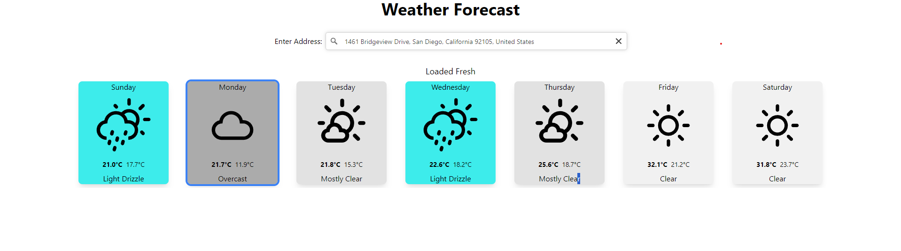

# WeatherForecast

This app allows users to enter an address to receive the forecast for the next 7 days( including today)

This app is structured of a Rails backend with a React frontend. All communication is done via HTTP with json payload/response

## Running the app

1. Create a .env file in the root of this repo
2. Run docker-compose up
3. Navigate on your browser to http://localhost:8080/
